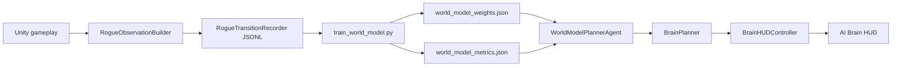

# LeWorldModel-Lite Research Cockpit

LeWorldModel-Lite Research Cockpit is a Unity research demo for explaining
model-based game AI in a small 2D roguelike environment. The project is inspired
by LeWorldModel-style world-model research, but the first implementation is
deliberately vector-based instead of a full pixel-JEPA system so that it can run
live, be inspected in Unity, and remain stable during a classroom or research
demo.

The demo answers one practical question:

> Can a player-facing AI show not only what action it takes, but also what it
> predicts, what futures it compares, and why one action is selected?

## Research Goal

The project demonstrates a lightweight world-model loop:

```text
Unity game state
-> vector observation
-> short-horizon dynamics/reward prediction
-> mission-aware planning
-> action ranking
-> AI coach suggestion + HUD explanation
```

The agent is not only a hard-coded bot. It combines:

- a learned dynamics/reward model trained from trajectories,
- a mission planner that estimates safe shortest paths,
- action ranking for all available actions,
- imagined 3-5 step futures,
- learning metrics exposed in the HUD.

This makes the demo useful for teaching model-based planning, rollout-based
decision making, and the tradeoff between research fidelity and live-demo
reliability.

## What This Is And Is Not

This repository is a LeWorldModel-lite demo.

It is:

- a Unity 2D roguelike AI research cockpit,
- a vector-observation world-model prototype,
- a live demo with Human / Coach / AI mode cycling,
- a trajectory collection and offline training pipeline,
- an explainable action-ranking interface.

It is not yet:

- a full pixel-based LeWorldModel reproduction,
- an end-to-end JEPA implementation from raw frames,
- a guaranteed optimal reinforcement learning agent,
- a final game with a fixed ending.

The original LeWorldModel direction is treated as the research inspiration. This
project focuses on a practical, stable version that can be shown live.

## Core Features

- Unity 2D roguelike environment with procedural levels.
- Cycle `HUMAN -> COACH -> AI` with `M` or the top-right mode button.
- AI Brain HUD showing:
  - suggested action,
  - action ranking,
  - predicted reward and future score,
  - imagined futures,
  - dynamics loss, reward loss, success proxy, and transition count,
  - plain-language explanation for the chosen action,
  - coach compliance and first-step risk warning in Coach Mode.
- Mission-aware planner that tries to:
  - reach the exit,
  - minimize wasted steps,
  - avoid enemy and obstacle costs,
  - collect food when it is worth the detour,
  - preserve food across endless levels.
- Unity-to-Python trajectory logging.
- PyTorch training script for a small dynamics and reward model.
- JSON weight export loaded by Unity at runtime.

## Current Objective

The game is endless: there is no fixed final level. Each exit advances to a new
randomly generated level. The run ends when food reaches zero.

The AI therefore optimizes survival-adjusted progress:

```text
score =
  safe shortest path to exit
  + useful food detours
  - enemy risk
  - obstacle cost
  - wasted steps
  + small learned model reward estimate
```

In presentation terms, the agent is trying to clear as many levels as possible
while spending fewer actions and avoiding unnecessary combat.

## Architecture



### Unity Components

- `RogueObservationBuilder`
  - Builds a 31-dimensional vector observation from the current game state.
- `RogueTransitionRecorder`
  - Records `obs, action, reward, next_obs, done` rows as JSONL.
- `WorldModelPlannerAgent`
  - Cycles Human / Coach / AI modes, loads model weights/metrics, records
    planner transitions, and publishes coach suggestions.
- `BrainPlanner`
  - Scores actions using mission planning, safety costs, heuristic rollout, and
    learned model predictions.
- `BrainHUDController`
  - Renders action ranking, imagined futures, metrics, and explanation text.

### Python Components

- `tools/world_model/train_world_model.py`
  - Loads Unity JSONL or synthetic data.
  - Trains a small MLP dynamics/reward model.
  - Exports JSON weights readable by Unity.
  - Exports metrics JSON/CSV.

## Project Structure

```text
Assets/
  Editor/
    RogueDemoSceneBuilder.cs
  Scenes/
    TrainingRoom.unity
    WorldModelPlannerRoom.unity
  Scripts/
    Board/
    Game/
    ML/
      BrainHUDController.cs
      BrainHUDData.cs
      BrainPlanner.cs
      RogueAgent.cs
      RogueObservationBuilder.cs
      RogueTransitionRecorder.cs
      WorldModelPlannerAgent.cs
      WorldModelWeights.cs
    Objects/
    Player/
    UI/
  StreamingAssets/
    world_model_weights.json
    world_model_metrics.json
  UI/
    GameUI.uxml
config/
  rogue_ppo.yaml
docs/
  architecture/
  demo/
tools/
  world_model/
    train_world_model.py
```

## Requirements

- Unity `6000.4.6f1` or compatible Unity 6 version.
- Python `3.10.x`.
- PyTorch for the world-model training script.
- Optional: Unity ML-Agents for PPO baseline training.

The project includes Unity package references in `Packages/manifest.json`.

## Running The Demo

1. Open the Unity project.
2. Open:

```text
Assets/Scenes/WorldModelPlannerRoom.unity
```

3. Press Play.
4. Use manual movement first if desired.
5. Press `M` or click the top-right mode button to cycle into `COACH`.
6. Watch the AI Brain HUD:
   - suggested action,
   - ranked alternatives,
   - imagined futures,
   - learning metrics,
   - explanation,
   - compliance and risk warning.
7. Press `M` again to cycle into `AI` autonomous mode.
8. Press `M` a third time to return to `HUMAN`.
9. Click `NEW RUN` or press `R` after game over.

For readability in the Unity Game tab, use `Scale = 1x` or enable
`Maximize On Play`.

## Training The World Model

The AI does not update neural weights automatically on every Play session. The
learning loop is offline:

```text
Run Unity / AI / PPO
-> collect transitions
-> train in Python
-> export JSON weights
-> reload Unity scene
```

Recorded transition rows follow this schema:

```json
{
  "schema": "rogue.transition.v2",
  "episode": 1,
  "step": 42,
  "obs": [0.0],
  "action": 3,
  "action_name": "right",
  "reward": 0.14,
  "next_obs": [0.0],
  "done": false,
  "outcome": "running",
  "level": 4,
  "food": 82
}
```

Train from a Unity JSONL file:

```powershell
python tools/world_model/train_world_model.py --input "PATH\TO\rogue_transitions.jsonl" --epochs 30
```

Run a smoke test:

```powershell
python tools/world_model/train_world_model.py --smoke --epochs 2
```

Train a synthetic fallback model:

```powershell
python tools/world_model/train_world_model.py --synthetic-game --synthetic-game-states 6000 --epochs 60 --hidden-size 96 --batch-size 256 --learning-rate 0.002 --reward-loss-weight 8
```

The script writes:

```text
Assets/StreamingAssets/world_model_weights.json
Assets/StreamingAssets/world_model_metrics.json
results/world_model_metrics.csv
```

## Evaluation And Demo Criteria

A successful demo should show:

- the game running in Unity,
- manual and AI toggle working,
- the agent moving through levels,
- action ranking updating live,
- at least one imagined 3-step future,
- explanation text for the selected action,
- visible model metrics,
- fallback behavior if learned weights are missing,
- a clear statement that this is LeWorldModel-lite, not a full pixel-JEPA
  reproduction.

The current game is endless, so progress is measured by:

- levels cleared,
- food remaining,
- average steps per level,
- avoidable combat frequency,
- model dynamics/reward loss.

## Research Limitations

The current implementation is intentionally scoped:

- Uses vector observations rather than raw pixels.
- Uses a compact MLP model rather than a full vision encoder.
- Uses short rollouts to avoid compounding model error.
- Uses mission planning for live stability.
- Uses offline retraining rather than online continual learning.

These constraints make the demo reliable while preserving the core research
idea: the agent chooses actions by comparing predicted futures.

## Suggested Next Steps

- Add a finite benchmark mode with a fixed seed set and target number of levels.
- Track average steps per level and food efficiency.
- Add a replay viewer for saved trajectories.
- Add a pixel encoder as an advanced branch.
- Add model-vs-heuristic ablation charts.
- Add automatic retraining scripts that consume the latest planner trajectories.

## Devin And Agent Skills

This repo includes a Devin-ready skill pack at:

```text
.agents/skills/
```

Start with `@skills:codebase-research`, then move through
`@skills:architecture-plan`, `@skills:implementation-agent`,
`@skills:test-and-verify`, and `@skills:pr-finalization` for larger tasks.

See `docs/devin/skills-setup.md` and `AGENTS.md` for the full workflow,
repo-specific prompts, Unity verification notes, and safe operating rules.

The broader reusable agent kit also includes:

```text
docs/agent/
.github/copilot-instructions.md
.cursor/rules/
CLAUDE.md
scripts/validate-agent-kit.ps1
scripts/install-agent-kit.ps1
```

Validate the kit with:

```powershell
powershell -ExecutionPolicy Bypass -File scripts/validate-agent-kit.ps1
```

## Credits

This project builds on the original open-source `2DRogueTest` Unity roguelike
prototype by Ryadel and extends it into a world-model research demo with
trajectory logging, model training, planning, and an AI Brain HUD.

## License

The base project is MIT licensed. This research demo keeps the same educational
spirit and is intended for study, presentation, and extension.
